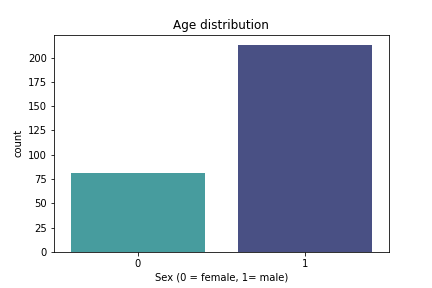
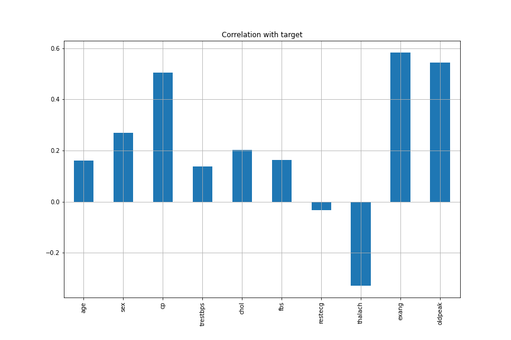

# Quantum Open Source Foundation project
Hello world, this is my quantum open source project on building a quantum variational classifier using the heart attack dataset. This will be a series of blogs in the order of:
1. Classical preprocessing, `this one`
2. Explaining the workings of a variational quantum model
3. Explain my finds and look at the best models
4. Characterising loss landscapes

My goal through this project are:
- Learn how a variational circuit works
- Explore the different types of optimizers
- Get a firm understaning of quantum machine learning
- Explore the loss landscape of variational models

My project plan is to:
1. Explore a specific dataset and preprocess it.
2. Create a quantum neural network (AKA variational classifier) by combining a featuremap, variational circuit and measurement component.
3. Explore different types of optimizers, featuremaps, depths of featuremaps and depths of the variational circuit.
4. Explain my observations based on the best 10 model configurations.
5. Try to understand why these models performed the best by characterising the loss landscape of the best models.

For this project we decided to use the heart attack data as our baseline. This is because, in medical aspects, heart attack is the leading disease that causes death. In computation aspect, the data was rather small and could easily be fitted on NISQ computers.

These are some of my findings and I hope we share the same idea about them. 

# Exploratory Data Analysis

Exploratory Data Analysis (EDA) refers to the critical prcess of performing initial investigations on a dataset so as to dicover patterns, spot anomalies, test hypotheses and check assumptions. It it usually good practice in data science to explore the data first before getting your hands dirty and starting to build models.

My EDA process was short as the series topic alluded earlier, I would like to focus on Quantum Machine Learning rather than dwell on data science!

## Data explorations
To start off, we imported necessary libraries: pandas, numpy, matplotlib, seaborn and pandas profiling, and loaded our dataset

```python
data = pd.read_csv(DATA_PATH)
```

The original dataset can be found [here](https://www.kaggle.com/imnikhilanand/heart-attack-prediction). 

We then check the shape of the datset and found that we have 14 columns that is 13 features and one target variable. We have 294 rows that means we have 294 datapoints on which we will use to train our model. When we check our columns we see the actual names in the heading. The explanations of the each column is as follows:

```python
print(data.columns)

Index(['age', 'sex', 'cp', 'trestbps', 'chol', 'fbs', 'restecg', 'thalach', 'exang', 'oldpeak', 'slope', 'ca', 'thal', 'num       '], dtype='object')

```

**Attribute Information**
- Age (age in years)
- Sex (1 = male; 0 = female)
- CP (chest pain type)
- TRESTBPS (resting blood pressure (in mm Hg on admission to the hospital))
- CHOL (serum cholestoral in mg/dl)
- FPS (fasting blood sugar > 120 mg/dl) (1 = true; 0 = false)
- RESTECH (resting electrocardiographic results)
- THALACH (maximum heart rate achieved)
- EXANG (exercise induced angina (1 = yes; 0 = no))
- OLDPEAK (ST depression induced by exercise relative to rest)
- SLOPE (the slope of the peak exercise ST segment)
- CA (number of major vessels (0-3) colored by flourosopy)
- THAL (3 = normal; 6 = fixed defect; 7 = reversable defect)
- num ==> TARGET (1 or 0)

When we look at the head of the data we see some missing values labeled `?`. We will try and fix this later. We proceed and check the info of the data and see most columns are under dtype `object` instead of `float64`. We will also need to fix this later on. This is because a dtype `object` can't be understood by our model. As our model only understands numerical values e.g float and integers. (@Rodney - please explain why)

When we check the unique values of each column, 
```python
def check_unique(df):
    """"
    Checks the unique value in each column
    :param df: The dataframe
    """
    for col in df.columns:
        unique = df[col].unique()
        print("Column: {} has {} unique values\n".format(col, unique))

```
we see that sex, cp , fbs, exang, oldpeak, slope, ca, thal and num are categorical variables, while the others are continuous variables. This will help inform us when deciding how to fill values with null spaces.


When we look at the target distribution, we can see that they are almost balanced, since one of the classes isn't more than 2/3 of the dataset.



When we look at the age distribution we see that most of the people are male:

 

We can definitely see that as you age, you are more prone to a heart attack until the age of 57, where your chances start reducing. At the age of 54 is the peak age where most people are susceptible to a heart attack.


This pairplot shows us the distribution of every class.

## Data cleaning
1. We first change the column name and the target variable as it has spaces

```python
data = data.rename(columns={'num       ':'num'})
```
2. When we check the values we see that the null values were recorded as `?` in the dataset. One way of handling this is to change the `?` in the data to be `np.Nan`. (@Rodney - maybe just say this is one way to handle this problem)

```python
def fix_missing_values(df):
    """"
    Changes ? in the data to be np.Nan
    :param df: The dataframe
    :return df: Fixed dataframe
    """
    
    cols = df.columns
    for col in cols:
        for i in range(len(df[col])):
            if df[col][i] == '?':
                df[col][i] = np.NaN
    return df
```
3. We change the data type of the `object` to `float64`

```python
def change_dtype(df):
    """"
    Changes the data type from object to float64
    :param df: The dataframe
    :return df: Fixed dataframe
    """    
    cols = df.columns
    for col in cols:
        if df[col].dtype == 'O':
            df[col] = df[col].astype("float64")
    return df
```
4. Fixing mixing values:
Handling missing data in Machine Learning is important as it may lead to drawing inaccurate inference from the data.

We will delete the columns with more than half of its members empty. This is because if we try and fill them most of the values will be having more fabricated values than the real values. (@Rodney - why? You need to explain these design choices with just a sentence or so)
- ca
- thal
- slope

Columns that have continuous values and the null values are not less than half, we try and fix this by either replacing with the mean, mode or median. For our case I used mean values. (@Rodney I dont understand what this means)
- trestbps
- chol
- thalach

This we will fix with the mode value since they are either `0` or `1` 
- fbs
- exang
- restecg

```python
def fix_missing_values(df):
    """"
    Fixes the missing values by either deleting or replacing
    :param df: The dataframe
    :return df: Fixed dataframe
    """
    def delete_missing_values(df):
        """
        Deletes the column with Null values which are less than half of its values
        """
        df = df[['age', 'sex', 'cp', 'trestbps', 'chol', 'fbs', 'restecg', 'thalach','exang', 'oldpeak', 'num']]
        return df
    def fill_with_mean(df):
        """
        Fills the NaN values with the mean value of the column
        """
        cols = ['trestbps', 'chol', 'thalach']
        for col in cols:
            df[col].fillna(value=df[col].mean(), inplace=True)
        return df
    def fill_with_mode(df):
        """
        Fills the NaN values with the mode value of the column
        """
        cols =['fbs', 'restecg', 'exang']
        for col in cols:
            df[col].fillna(value=df[col].mode()[0], inplace=True)
        return df
    df = delete_missing_values(df)
    df = fill_with_mean(df)
    df = fill_with_mode(df)
    return df
```
5. We remove duplicate rows

```python
data.drop_duplicates(inplace=True)
```

## Profiling
One way of doing better and faster Exploratory Data Analysis in a very short time is to use pandas profiling. It basically returns and interactive report in HTML format which is quick to analyse the data.
@Rodney maybe explain what profiling is, in a sentence or two?

We first check the correlation of the columns to the target variable:
```python
data.drop('num', axis=1).corrwith(data['num']).plot(kind='bar', grid=True, figsize=(12, 8), title="Correlation with target")

```



We see that exang has the highest prositive correlation followed by oldpeak and then cp. Thalach has the highest negative correlation.

Based on the correlation of the features with the target variable, we chose the first 4 positively highly correlated features. (@Rodney this is a very bold statement to make. Maybe state "looking at the correlations, these 4 variables seem to be the most relevant and hence, we choose them as our features for our analysis")

We finish off by checking the pandas profiling:

```python
pp.ProfileReport(df=data, dark_mode=True, explorative=True)
```

From the overview we are able to see we have to warnings which we will ignore. (@Rodney why? please explain)
1. `df_index` has unique values. This is beacues it is the index column so it has all unique values.
2. `oldpeak` has 188 (64.2%) zeros. The data is not normalized hence most values are 0.


## Next steps
1. We shuffle the data to introduce some randomness: we maintain the same random state for all operations.
2. We remove less relevant features and remain with the top 4 features, 3 postively correlated with the target variable and 1 negatively correlated with the target variable.
3. We normalize the data using `sklearn.preprocessing.MinMaxScaler` between ranges $-2\pi$ and $2\pi$. This is to ensure we utilize most of the Hilbert space as we will be encoding the data into quantum states.
4. We finally split the data into train and test sets, keeping the test size to 0.3.

```python
def normalize_data(dataPath="../../Data/Processed/data.csv"):
    data = pd.read_csv(dataPath)
    data = shuffle(data, random_state=42)
    X, Y = data[['sex', 'cp', 'exang', 'oldpeak']].values, data['num'].values
    # normalize the data
    scaler = MinMaxScaler(feature_range=(-2 * np.pi, 2 * np.pi))
    X = scaler.fit_transform(X)
    X_train, X_test, Y_train, Y_test = train_test_split(X, Y, test_size=0.3, random_state=42)
    return X_train, X_test, Y_train, Y_test
```

# Lets move to the next blog: "Explaining the workings of a variational quantum model"
