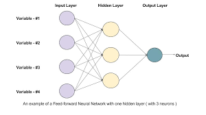
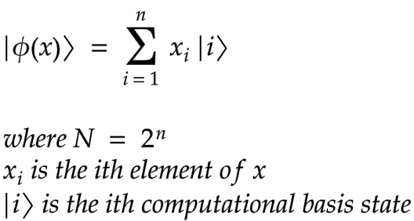
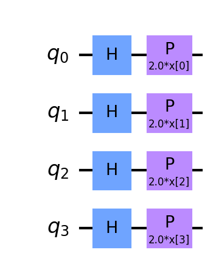

# Explaining Variational Quantum Classifiers

Quantum machine learning usually involves machine learning that runs on quantum computers. A typical quantum machine learning model is composed of 2 parts, a classical part for pre- and post-processing data and a quantum part for harnessing the power of quantum mechanics to perform certain calculations easier, such as solving extremely large systems of linear equations. One of the main motivations for using quantum machine learning is because it is difficult to train very large machine learning models on huge datasets. The hope is that features of quantum computing, such as quantum parallelism or the effects of interference and entanglement, can be used as resources. 

<!-- 
*From: https://ujjwalkarn.me/2016/08/09/quick-intro-neural-networks/* -->

*From: https://www.learnopencv.com/understanding-feedforward-neural-networks/*
First and foremost, a feed forward neural network consists of hidden layers, each of which contain neurons. The data inputs are first fed into the network and the values at the first hidden layer (i.e. the neurons) are a product of weights with the inputs summed, with biases. These values may then be passed to an activation function, e.g. ReLU, where values below zero are zeroed and the others are maintained. This process is repeated until a final output is obtained depending on the architecture of your network.

A quantum neural network has many definitions in literature, but can broadly be thought of as a quantum circuit with trainable parameters. These quantum models are referred to as variational quantum circuits. With this, we can finally define a quantum neural network as a variational quantum circuit - a parameterised quantum circuit that can be optimized by training the parameters of the quantum circuit, which are qubit rotations, and the measurement of this circuit will approximate the quantity of interest - i.e. the label for the machine learning task. 

Machine learning techniques are built around:
1. An adaptable system that allows approximation.
2. Calculation of a loss function in the output layer.
3. A way to update the network to minimise the loss function and improve on the model's ability to perform the machine learning task.
 
We hope that any part of this process is better on a quantum computer. To pursue the task of classification using quantum machine learning, we construct a hybrid neural network based on a quantum variational classifier. Quantum variational classifiers are suggested to have an advantage over certain classical models through a higher effective dimension and faster training ability.

Given a dataset about patient's information, can we predict if they are likely to have a heart attack or not. This is a binary classification problem, with a real input vector $x$ and a binary output $y$ in $\{0, 1\}$. We want to build a quantum circuit whose output is a quantum state 

## Process
This is achieved by designing a quantum circuit that behaves similarly to a traditional machine learning algorithm. The quantum machine learning algorithm contains a circuit which depends on a set of parameters that, through training, will be optimised to reduce the value of a loss function.

*From swissquantumhub*

In general, there are three steps to this type of quantum machine learning model:
1. State preparation
2. Model circuit
3. Measurement

### 1. Data encoding/state preparation
When we want to encode our classical data into quantum states, we perform certain operations to help us work with the data in quantum circuits. One of the steps is called data embedding which is the representation of classical data as a quantum state in Hilbert space via a quantum feature map. A feature map is a mathematical mapping that helps us embed our data into (usually) higher dimensional spaces, or in this case, quantum states. It can be thought of as a variational quantum circuit in which the parameters depend on the input data, which for our case is the classical heart attack data. We will need to define a variational quantum circuit before going any further. Recall that a variational quantum circuit depends on parameters that can be optimised by classical methods.

For embedding we take a classical data point, $x$, and encode it by applying a set of gate parameters in the quantum circuit where gate operations depend on the value of $x$, hence creating the desired quantum state:

Here are some examples of well known data embedding methods:

##### a) Basis embedding
In this method, we simply encode our data into binary strings. We convert each input to a computational basis state of a qubit system. For example ${x = 1001}$ is represented by a 4 qubit system as the quantum state $\left| 1001 \right\rangle$. Some points to consider on basis embedding are: 
- amplitude vectors become sparse
- there is a lot of freedom to do computation
- schemes to implement it are usually not efficient 

##### b) Amplitude embedding
Here, we encode the data as amplitudes of a quantum state. A normalized classical N - dimensional datapoint ${x}$ is represented by the amplitudes of a n-qubit quantum state $\left| \phi ( x)\right\rangle$ as 

For example

This is method is intuitive but schemes to implement it are also rather complicated.

##### c) Angle embedding
Here, we use the so-called angle encoding. We encode classical information into angle rotations of a qubit. This results to using the feature values of an input data point, x, as angles in a unitary quantum gate.

#### Feature maps
Feature maps allow you to map data into a higher dimensional space. The input data is encoded in a quantum state via a quantum
feature map, an encoding strategy that maps data to quantum Hilbert space. A quantum computer can analyse the input data in this feature space, where a classifier aims to find a hyperplane to separate the data. 

Feature maps encode our classical data $x_i$ into quantum states $\left|\phi(x_i)\right\rangle$. In this analysis, we use three different types of featuremaps precoded in the Qiskit circuit library, namely ZZFeaturemap, ZFeaturemap and PauliFeaturemap. We varied the depths of these featuremaps (1, 2, 4) in order to check the different models' performance. By increasing a feature map's depth, we introduce more entanglement into the model and repeat the encoding circuit.

*Pauli feature map*

*ZZ feature map*

*Z feature map*

### 2. Model circuit
The second step is the model circuit, or the classifier strictly speaking. A parameterised unitary operator $U(w)$ is created such that 

$\left| \psi(x: \theta)\right\rangle = U(w) \left| \psi(x)\right\rangle$ .

The model circuit is constructed from gates that evolve the input state. The circuit is based on unitary operations and depends on external parameters which will be adjustable. Given a prepared state $\left| \psi_i\right\rangle$ the model circuit, $U(w)$ maps $\left| \psi_i\right\rangle$ to another vector $\left| \psi_i\right\rangle = U(w)\left| \psi_i\right\rangle$.  In turn $U(w)$ consists of a series of unitary gates.

We used the RealAmplitudes variational circuit from Qiskit for this. Increasing the depth of the variational circuit introduces more trainable parameters into the model.

*Real Amplitudes*

### 3. Measurement
The final step is the measurement step, which estimates the probability of belonging to a class by performing certain measurements. It’s the equivalent of sampling multiple times from the distribution of possible computational basis states and obtaining an expectation value.

For demonstration purposes I made some design considerations. I chose the final circuit to have `ZZFeatureMap` with a depth of 1 and a variational form `RealAmplitudes` with a depth of 1. This is to make a simple illustration of how the full model works. 

*Overall circuit*

#### Training
As alluded to above, during training we aim to find the values of parameters to optimise a given loss function. We can perform optimisation on a quantum model similar to how it is done on a classical neural network. In both cases, we perform a forward pass of the model and calculate a loss function. We can then update our trainable parameters using gradient based optimisation methods since the gradient of a quantum circuit is possible to compute. During training we use the mean squared error (MSE) as loss function. This allows us to find a distance between our predictions and the truth, captured by the value of the loss function.

We will train our model using ADAM, COBYLA and SPSA optimizers. Below is a brief explanation of these optimizers, but I encourage you to read a bit further on their pros/cons.

##### 1. ADAM
Known as the Adaptive Moment Estimation Algorithm, but abbreviated ADAM. This optimizer simply estimates moments of the loss and uses them to optimize the loss function. It is essentially a combination of gradient descent with a momentum algorithm and the RMS (Root Mean Square) Prop algorithm. The ADAM algorithm calculates an exponentially weighted moving average of the gradient and then squares the calculated gradient. This algorithm has two decay parameters that control the decay rates of these calculated moving averages.

##### 2. COBYLA
Known as Constrained Optimization by Linear Approximations. It constructs successive linear approximations of the loss function and constrains via a simplex of n+1 points (in n dimensions), and optimizes these approximations in a trust region at each step. COBYLA supports equality constraints by transforming them into two inequality constraints. 

##### 3. SPSA 
"SPSA uses only the objective function measurements. This contrasts with algorithms requiring direct measurements of the gradient of the objective function. SPSA is especially efficient in high-dimensional problems in terms of providing a good solution for a relatively small number of measurements of the objective function. The essential feature of SPSA, which provides its power and relative ease of use in difficult multivariate optimization problems, is the underlying gradient approximation that requires only two objective function measurements per iteration regardless of the dimension of the optimization problem. These two measurements are made by simultaneously varying in a "proper" random fashion all of the variables in the problem (the "simultaneous perturbation"). This contrasts with the classical ("finite-difference") method where the variables are varied one at a time. If the number of terms being optimized is p, then the finite-difference method takes 2p measurements of the objective function at each iteration (to form one gradient approximation) while SPSA takes only two measurements." (See ref 5)

By now I hope you have gotten the gist of how a quantum machine learning model works as well as an overview of some optimizers. Next we will look at the findings that I discovered when training the model on the heart attack data as well as the popular iris and wine datasets.

**The code can be found at [code](https://github.com/0x6f736f646f/variational-quantum-classifier-on-heartattack)**

#### References
1. https://en.wikipedia.org/wiki/Quantum_machine_learning
2. https://medium.com/xanaduai/analyzing-data-in-infinite-dimensional-spaces-4887717be3d2
3. https://arxiv.org/abs/1412.6980
4. https://docs.scipy.org/doc/scipy/reference/optimize.minimize-cobyla.html
5. https://www.jhuapl.edu/spsa/
6. Ventura, Dan and Tony Martinez. "Quantum associative memory" Information Sciences 124.1-4 (2000):273-296
7. M. Schuld and N. Killoran, Phys. Rev. Lett. 122, 040504 (2019)
8. A. Abbas et al. "The power of quantum neural networks." arXiv preprint arXiv:2011.00027 (2020). 
