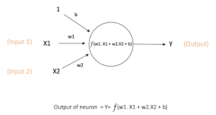
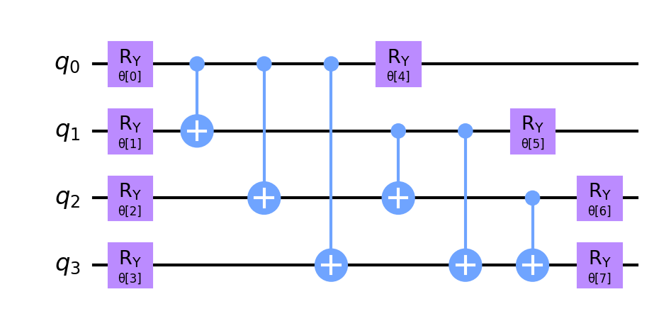

# Explaining Variational Quantum Classifiers

Quantum machine learning is usually machine learning that runs on quantum computers. A normal quantum machine learning model is composed of 2 parts, a classical part for post and pre processing and a quantum part for harnessing the power to perform certain calculations easily such as extremely large systems of linear equations. One of the main motivations is because it is difficult to train machine learning models on huge datasets. The hope is that features of quantum computing such as quantum parallelism or the effects of interference and entanglement can be used as resources. (@Rodney - if you have used any resources like wikipedia etc, we must reference them)

<!-- 
*From: https://ujjwalkarn.me/2016/08/09/quick-intro-neural-networks/* -->

*From: https://www.learnopencv.com/understanding-feedforward-neural-networks/*
First and foremost, a feed forward neural network, with single layer perceptron, consist of a single node. The inputs is fed directly to the node then the output is the product of the weight and inputs summed with the bias. The output may then passed to an activation functions, e.g ReLU where values below zero are zeroed and the others are maintained.

A quantum neural network, refers to a quantum circuit with trainable parameters. This viewpoint of quantum computation goes by, variational quantum circuits. With this we can finally define a quantum neural network, variational quantum circuit, as a parameterized quantum circuit that can be optimized by training the parameters of the quantum circuit, which are qubit rotations and the measurement of this circuit will approximate the quantity of interest - i.e. the label for the machine learning task. In this case a parameterised quantum circuit is one which has parameters in form of angle of rotation of the gates to specific qubits.

@Rodney this paragraph is very confusing. I think start by saying what a feedforward model is, then how a variational model maps data to hilbert space, applies a parameterised model, then measures to classify. etc.
@Rodney - I tried to reword this, but I actually dont think this is correct. Please read up on what a quantum neural network is and try explain it in a very simple way. Like a 1 layer NN for example. And please explain what a parameterised quantum circuit is.

For example, a variational quantum circuit is a parameterized quantum circuit that can be optimized by training the parameters of the quantum circuit, which are qubit rotations and the measurement of this circuit will approximate the quantity of interest - i.e. the label for the machine learning task. 

Machine learning techniques are built around:
1. An adaptable system that allows approximation.
2. Calculation of a loss function in the output layer.
3. A way to update the network continuously to minimise the loss function and improve on the model's ability to perform the machine learning task.
 
We hope that the process is cheaper on a quantum computer and that preparing quantum states is faster/cheaper than performing matrix products on CPUs and GPUs. To pursue this task using quantum machine learning, we construct a novel hybrid neural network (@Rodney this model is not novel!), based on a quantum variational classifier. Quantum variational classifiers are known to have an advantage in model size compared to classical neural networks (@Rodney I dont think so, if so, please reference the paper that says this).

Given a dataset about patient's information, can we predict if he is likely to have a heart attack or not. This is a binary classification problem, with an input real vector $x$ and a binary output $y$ in $\{0, 1\}$. We want to then build a quantum circuit whose output is a quantum state 

## Process
This is achieved by designing a quantum circuit that behaves similarly to a traditional machine learning algorithm. The quantum machine learning algorithm contains a circuit which depends on a set of parameters that, through training, will be optimised to reduce the value of a loss function.

*From swissquantumhub*

In general, there are three steps to this type of quantum machine learning model:
1. State preparation
2. Model circuit
3. Measurement

### 1. Data encoding/state preparation
When we want to encode our classical data into quantum states, we perform certain operations to help us work with the data in quantum circuits. One of the steps is called data embedding which is the representation of classical data as a quantum state in Hilbert space via a quantum feature map. A feature map is a mathematical mapping that helps us embed our data into (usually) higher dimensional spaces, or in this case, quantum states. It can be thought of as a variational quantum circuit in which the parameters depend on the input data which for our case is the classical heart attack data. We will need to define a variational quantum circuit before going any further. A variational quantum circuit is a quantum algorithm that depends on parameters and can be optimised by either classical or quantum methods.

#### Data embedding
@Rodney I dont understand this sentence below. Please re-write.
For data embedding we take out classical datapoint, x and make it into a set of paramters of a quantum gate in a quantum circuit hence creating out desirable quantum state.
$x \rightarrow \left| \phi(x) \right\rangle $
Here are some examples of well known data embedding methods:

##### a) Basis embedding
In this method, we simply encode our data into binary strings. We convert each input to a computational basis state of a qubit system. For example ${x = 1001}$ is represented by a 4 qubit system as the quantum state $\left| 1001 \right\rangle$. It is  (@Rodney it is what?)
- amplitude vectors become sparse
- most freedom to do computation
- schemes not efficient (@Rodney please reference!)

##### b) Amplitude embedding
We encode the data as amplitudes of a quantum state. A normalized classical N - dimensional datapoint ${x}$ is represented by the amplitudes of a n-qubit quantum state $\left| \phi ( x)\right\rangle$ as 

For example

This is: 
- simple, intuitive
- inexpensive @Rodney not necessarily true - can be expensive in gate cost to implement the right amplitudes!

##### c) Angle embedding
Here, we use the so-called angle encoding. Practically, this amounts to using the feature values of an input data point, say x, as angles in a unitary quantum gate. We take the state preparation circuit as the unitary gate - @Rodney - huh? What does this sentence mean?

##### d) Higher order embedding
It converts a 2D data point into a 3D data point (@Rodney no! wrong, please rewrite/read)

#### Feature maps
Feature maps allow you to map data into a higher dimensional space. This allows you to perform computation over non-linear basic functions (@Rodney are you sure? please reference). Feature maps encode our classical data $x_i$ into quantum states $\left|\phi(x_i)\right\rangle$. Using parameterised quantum circuits implies using exponential number of functions with respect to the no of qubit from the parameter circuit (@Rodney No. This is not right. What are you trying to say here?). We use three different types of featuremaps precoded in the Qiskit circuit library, namely ZZFeaturemap, ZFeaturemap and PauliFeaturemap. We varied the depths of these featuremaps (1, 2, 4) in order to check the different models' performance.

*Pauli feature map*

*ZZ feature map*

*Z feature map*

### 2. Model circuit
The second step is the model circuit, or the classifier strictly speaking. A parameterised unitary operator $U (\theta)$ is created such that $\left| \psi(x: \theta)\right\rangle = U(\theta) \left| \psi(x)\right\rangle$ . The model circuit is constructed from gates that evolve the input state. The circuit is based on unitary operations and depends on external parameters which will be adjustable. Given a prepared state $\left| \psi_i\right\rangle$ the model circuit, $U (w)$ maps $\left| \psi_i\right\rangle$ to another vector $\left| \psi_i\right\rangle = U(w)\left| \psi_i\right\rangle$.  In turn $U(w)$ consists of a series of unitary gates.

We used the RealAmplitudes variational circuit from Qiskit for this:

*Real Amplitudes*

### 3. Measurement
The final step is the measurement step, which estimates the probability of belonging to a class by performing several measurements. It’s the equivalent of sampling multiple times from the distribution over all possible computational basis states.

The final circuit has `ZZFeatureMap` with a depth of 1 and a variational form `RealAmplitudes` with a depth of 1. (@Rodney please explain to the reader how you chose this final circuit)

*Overall circuit*

#### Training
As alluded to above, during training we aim to find the values of parameters to optimise a given loss function. We can perform optimisation on a quantum model similar to how it is done on a classical neural network. In both cases, we perform a forward pass of the model and calculate a loss function. We can then update our trainable parameters using gradient based optimisation methods since the gradient of a quantum circuit is possible to compute. During training we use the mean squared error (MSE) as loss function. This allows us to find a distance between our predictions and the truth, captured by the value of the loss function.

We will train our model using ADAM, COBYLA and SPSA optimizers. @Rodney references

##### 1. ADAM
Known as the Adaptive Moment Estimation Algorithm, but abbreviated ADAM. This algorithm simply estimates moments of the loss and uses them to optimize a function. It is essentially a combination of the gradient descent with momentum algorithm and the RMS (Root Mean Square) Prop algorithm. The ADAM algorithm calculates an exponentially weighted moving average of the gradient and then squares the calculated gradient. This algorithm has two decay parameters that control the decay rates of these calculated moving averages.

##### 2. COBYLA
Known as Constrained Optimization by Linear Approximations. It constructs successive linear approximations of the objective function and constrains via a simplex of n+1 points (in n dimensions), and optimizes these approximations in a trust region at each step. COBYLA supports equality constraints by transforming them into two inequality constraints. 

##### 3. SPSA  @Rodney - this is just copied exactly from a paper! This is plagiarism! You have to rewrite in your OWN WORDS and reference the paper!
SPSA uses only the objective function measurements. This contrasts with algorithms requiring direct measurements of the gradient of the objective function. SPSA is especially efficient in high-dimensional problems in terms of providing a good solution for a relatively small number of measurements of the objective function. The essential feature of SPSA, which provides its power and relative ease of use in difficult multivariate optimization problems, is the underlying gradient approximation that requires only two objective function measurements per iteration regardless of the dimension of the optimization problem. These two measurements are made by simultaneously varying in a "proper" random fashion all of the variables in the problem (the "simultaneous perturbation"). This contrasts with the classical ("finite-difference") method where the variables are varied one at a time. If the number of terms being optimized is p, then the finite-difference method takes 2p measurements of the objective function at each iteration (to form one gradient approximation) while SPSA takes only two measurements. 

@Rodney - please add a short concluding paragraph saying what we discussed and what the next blog/tutorial will cover

**The code can be found at [code](https://github.com/0x6f736f646f/variational-quantum-classifier-on-heartattack)**
